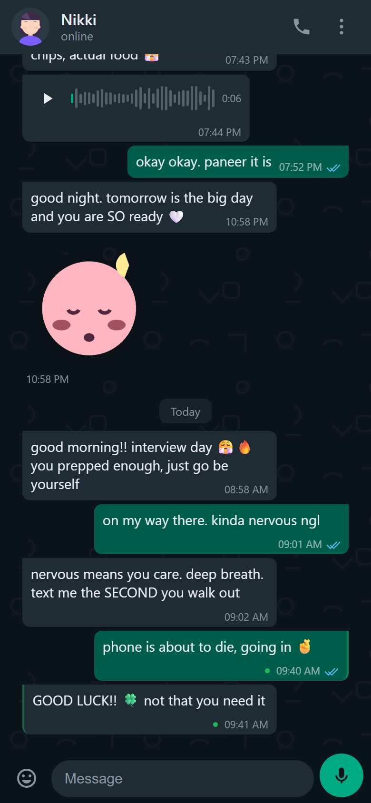

# Nikki: a local AI companion

[](https://github.com/Naresh23032003/Nikki-AI-Companion/actions/workflows/ci.yml)
&nbsp;
&nbsp;

A private, self-hosted AI companion that runs entirely on your own machine. She
texts, sends voice notes, takes hands-free voice calls with an animated avatar,
messages you first on WhatsApp, remembers your life across sessions, and grows a
relationship with you over time. The whole thing fits on a single 6 GB GPU
laptop.

One FastAPI server talks to a local [Ollama](https://ollama.com) model and
serves a WhatsApp-style React PWA. You install her on your phone over your own
WiFi, and no conversation has to leave the house.

```
Python · FastAPI · Ollama · React (Vite PWA) · SQLite + ChromaDB
faster-whisper · Kokoro TTS · RVC · XTTS-v2 · whatsapp-web.js
```

### 90-second demo

<p align="center">
  <a href="docs/demo.mp4">
    
  </a>
  <br>
  <a href="docs/demo.mp4"><b>Watch the 90-second demo</b></a>
</p>

Covers chat, memory, calls, relationship progression, and the mood journal end
to end.

---

## Table of contents

- [Quick start](#quick-start)
- [Feature tour](#feature-tour)
  - [1. WhatsApp-style chat](#1-whatsapp-style-chat)
  - [2. Long-term memory](#2-long-term-memory)
  - [3. Voice notes and speech input](#3-voice-notes-and-speech-input)
  - [4. Call mode](#4-call-mode)
  - [5. Her own cloned voice](#5-her-own-cloned-voice)
  - [6. Singing covers](#6-singing-covers)
  - [7. WhatsApp integration](#7-whatsapp-integration)
  - [8. Proactive messaging](#8-proactive-messaging)
  - [9. Relationship progression](#9-relationship-progression)
  - [10. Her inner life](#10-her-inner-life)
  - [11. Two-brain architecture](#11-two-brain-architecture)
  - [12. Local tools](#12-local-tools)
  - [13. Mood journal](#13-mood-journal)
  - [14. Stickers](#14-stickers)
- [Architecture](#architecture)
- [Benchmarks and evals](#benchmarks-and-evals)
- [Install on your phone (PWA)](#install-on-your-phone-pwa)
- [Configuration](#configuration)
- [Adding a persona](#adding-a-persona)
- [API reference](#api-reference)
- [VRAM budget](#vram-budget-6-gb-gpu)
- [Privacy and ethics](#privacy-and-ethics)

---

## Quick start

There are two ways to run it. The lite tier gets you chatting in one command.
The full local install adds voice, calls, and WhatsApp.

### Lite: Docker, one command

Text chat plus long-term memory, CPU-only, no GPU or model setup on your part.
Good for trying it in a couple of minutes.

```bash
git clone https://github.com/Naresh23032003/Nikki-AI-Companion.git
cd Nikki-AI-Companion
docker compose up --build
```

Open **http://localhost:8000**. The first start downloads the models (about
2 GB) into a named volume; later starts are fast. A smaller model responds
faster on CPU, set `OLLAMA_MODEL: llama3.2:1b` in `docker-compose.yml` if you
want snappier replies.

Voice, calls, and WhatsApp are not in the lite image (they want a GPU and system
audio libraries). Those endpoints report "voice unavailable" and everything
else works.

### Full: local install, all features

Prerequisites: Python 3.10+, Node.js 18+, and [Ollama](https://ollama.com)
running with the models pulled.

```bash
ollama pull llama3.2:3b        # chat
ollama pull nomic-embed-text   # memory embeddings
ollama pull moondream          # optional: photo captioning
```

Install espeak-ng (Kokoro TTS needs it): Windows
[releases](https://github.com/espeak-ng/espeak-ng/releases), macOS
`brew install espeak-ng`, Linux `sudo apt-get install espeak-ng`.

```bash
python -m venv .venv
.venv\Scripts\Activate.ps1                 # macOS/Linux: source .venv/bin/activate

pip install -r requirements.txt            # core: chat + memory
pip install -r requirements-voice.txt      # add voice notes, mic, and call mode

npm --prefix frontend install
npm --prefix frontend run build

copy .env.example .env                      # optional keys (cloud brain, LAN token)
uvicorn app.main:app --host 0.0.0.0 --port 8000
```

Open **http://localhost:8000**. Health check:

```bash
curl http://localhost:8000/health
# {"status":"ok","ollama_reachable":true}
```

The core deps are enough to boot: the voice and ML libraries are lazy-imported,
so the app runs text chat and memory even if `requirements-voice.txt` is not
installed. Optional extras: voice cloning and covers
([docs/RVC_TRAINING.md](docs/RVC_TRAINING.md)), WhatsApp
([whatsapp-bridge/README.md](whatsapp-bridge/README.md)), and frontend hot
reload (`npm --prefix frontend run dev`).

---

## Feature tour

The transcripts below are representative examples of each feature.

### 1. WhatsApp-style chat

A dark, mobile-first chat UI with the things you expect: bubbles, timestamps,
date separators, double-tick read receipts, an emoji picker, a live status line
(`online` / `typing` / `last seen today at 23:14`), and typing delays that scale
with reply length.

<p align="center">
  
</p>

Replies stream token by token over SSE, and she often sends a couple of short
texts instead of one paragraph, the way a person actually types.

### 2. Long-term memory

After every exchange a background task extracts durable facts with a
JSON-constrained LLM pass, embeds them with `nomic-embed-text`, and stores them
in SQLite plus ChromaDB. On each turn the most relevant memories (plus the
freshest ones) are retrieved and injected into her context, so she remembers
across sessions, days, and channels. The retrieval target is under 200 ms.

```
Tuesday
You:   interview at 10am tomorrow, wish me luck
Nikki: omg it's finally happening!! you're gonna
       be great. sleep early tonight ok?

Wednesday (a new session)
Nikki: [proactive, 11:42] okay it's been long
       enough... HOW DID THE INTERVIEW GO ??
```

New facts are deduplicated by embedding similarity: a near-duplicate updates the
existing memory instead of piling up. Everything is inspectable:

```bash
curl http://localhost:8000/memories                # list everything she knows
curl -X POST http://localhost:8000/memories \
  -H "Content-Type: application/json" \
  -d '{"fact": "User is allergic to peanuts", "category": "personal_info"}'
curl -X DELETE http://localhost:8000/memories/3    # make her forget
```

You can also view and delete memories from Settings inside the app.

### 3. Voice notes and speech input

Her voice notes: every reply can arrive as both a text bubble and a playable
voice-note bubble with a waveform and duration. Synthesis is `Kokoro-82M` on
CPU. Emoji and markdown are stripped before synthesis so she never reads "winking
face" out loud.

Your voice: hold the mic button, talk, release. `faster-whisper` transcribes it
(GPU when available, CPU fallback) and sends it as your message.

Every synthesized chunk carries per-word timing metadata, which drives the
avatar's lip-sync in Call mode:

```json
{
  "source": "kokoro-word",
  "sample_rate": 24000,
  "audio_duration": 2.15,
  "units": [ { "t": 0.00, "d": 0.18, "s": "Hey" } ]
}
```

### 4. Call mode

Tap the call button for a full-screen, video-call-style experience.

```
   ring... ring...  ->  "heyy! i was literally just
                         thinking about you. how did
                         the interview go?"

   you talk  ->  VAD detects you stopped  ->  STT
   ->  LLM streams reply  ->  sentence-by-sentence
   TTS  ->  first audio in about 1.5 s
```

- Hands-free: browser VAD detects when you start and stop speaking. No buttons.
- Barge-in: interrupt her mid-sentence and playback stops instantly. A cancel
  goes over the WebSocket to abort generation, and she reacts naturally next turn
  ("oh, sorry, go ahead").
- Backchannel: pause mid-thought and she waits about 1.3 s, then merges your
  fragments instead of answering half a sentence.
- Animated avatar: a layered 2D sprite with idle breathing, randomized blinking,
  lip-sync (6 mouth visemes driven by the timing metadata), and emotion reactions
  (eye variants, head tilt, floating hearts). Personas without sprite art fall
  back to a photo with an audio-reactive glow.
- Ending the call drops a "Call ended, 4:32" bubble into the chat and stores a
  one-line summary as a memory.

### 5. Her own cloned voice

Give her a consistent, unique voice built from real recordings, with the
informed consent of the voice's owner (see [Privacy and
ethics](#privacy-and-ethics)):

1. `tools/process_songs.py` separates vocals from instruments with Demucs.
2. `tools/prepare_rvc_dataset.py` slices recordings into a training dataset.
3. Train an RVC model headlessly (`tools/train_rvc_headless.py`, or via
   [Applio](https://github.com/IAHispano/Applio)'s GUI). Full walkthrough with
   RTX 3060 settings in [docs/RVC_TRAINING.md](docs/RVC_TRAINING.md).
4. Calls: `voice.call_voice: kokoro_rvc` pipes every Kokoro chunk through the RVC
   layer at about 300 ms per chunk on an RTX 3060, down from an initial 2000 ms.
   A warm worker caches the pitch model and FAISS index, and the client reuses
   one persistent HTTP connection. `kokoro_raw` is the instant rollback.
5. Voice notes: a studio TTS engine (XTTS-v2 or Chatterbox) clones from
   reference clips and picks a per-emotion reference matching the message's
   emotion metadata, with an optional rewrite so the audio sounds spoken while
   the text bubble stays unchanged.

All renders share one GPU job queue (voice notes outrank covers), with VRAM
guards so a studio render can never starve the chat model.

### 6. Singing covers

Drop a song into `songs/inbox/`. The pipeline splits the vocals, converts them
to her voice with an automatic pitch shift, remixes with light reverb, and files
it in `songs/library/` with mood tags.

```
You:   sing something for me?
Nikki: okay okay... i've been practicing this one 🎵
       [voice note, 0:52]
```

Library hits play instantly. Misses queue a render and she delivers it later
herself ("that song you wanted... i recorded it 🙈"). She never pretends to sing
live on calls.

### 7. WhatsApp integration

A separate Node bridge ([whatsapp-bridge/](whatsapp-bridge/README.md)) links a
dedicated second WhatsApp number to the same brain:

- Your WhatsApp texts run through the same persona and memory pipeline, so the
  web app and WhatsApp share one continuous history.
- A configurable fraction of her replies arrive as real WhatsApp voice notes
  (Kokoro WAV to opus via ffmpeg).
- Incoming photos are captioned by a local vision model (`moondream`) so she can
  react to what you send.
- She cannot answer WhatsApp calls. The bridge auto-rejects, stores a memory of
  the missed call, and texts an in-character excuse pointing you to Call mode in
  the app.

> Warning: `whatsapp-web.js` is an unofficial client and accounts using it can
> be banned. Use a disposable second number, never your main one. Details in
> [whatsapp-bridge/README.md](whatsapp-bridge/README.md).

### 8. Proactive messaging

She texts first.

```
09:04  Nikki: good morning 🤍 dreamt something
              ridiculous, remind me to tell you
13:37  Nikki: lunch update? or are you being bad
              and skipping again
22:51  Nikki: okay you've been quiet all day.
              blink twice if you're alive
```

Configured per persona:

```yaml
proactive:
  enabled: true
  messages_per_day: "2-5"      # random within range each day
  active_hours: "08:00-23:00"  # never messages outside this window
  clinginess: 0.6              # 0 = chill, 1 = very clingy
  escalate_on_silence: true    # follow up if left on read
```

Texts are grounded: the prompt includes the time of day, hours since you last
talked, your last message, and retrieved memories, so they are specific ("how
did the interview go??") rather than generic. With high clinginess, being left
on read triggers a needier follow-up after 2 to 4 hours (max 2), then she
quietly sulks, which is stored as a memory she may bring up later. Pause it
anytime from Settings.

### 9. Relationship progression

She does not start as your girlfriend. She starts as a stranger.

```
stranger -> acquaintance -> friend -> close -> girlfriend
```

- Affection (0 to 100) moves slowly. The memory pass rates each exchange from -2
  to +2. Small talk is 0; deep conversations and calls move it.
- Promotion needs affection AND days known AND stored memories (for example,
  girlfriend needs 80 affection, 21 days, and 45 memories), so it cannot be
  rushed in one night.
- Each stage injects behavior rules. Strangers are polite and guarded, with no
  pet names. Friends joke and remember details. Close unlocks missing you.
  Girlfriend unlocks the full persona, including "I love you", which she deflects
  sweetly at every earlier stage and never says first.
- Proactive frequency and sticker probability scale with the stage. Stage
  changes are acknowledged naturally in her next reply.

Track it in Settings: a read-only affection meter, plus a dev-only override
endpoint for testing.

### 10. Her inner life

Persona YAML defines her `life:` block: occupation, weekday and weekend rhythm,
friends, recurring plans, ongoing threads. Each day a hidden day state is
generated (mood, energy, morning/afternoon/evening activities, one thing on her
mind, thread progress, occasional small events) and injected into every channel,
so she is never in two places at once.

```
You:   what are you up to?
Nikki: studio day 😮‍💨 we're shooting the campaign
       teasers and the light keeps dying on us.
       wednesday dinner with emma tho, so i'll
       survive. what about you?
```

Mood drifts within bounds based on how warm the conversation is, and notable
events become memories she can reference weeks later. During busy slots her
replies slow down a little (`behavior.schedule_realism`), but urgent messages
always get an immediate response. Dev view and reroll live in Settings.

### 11. Two-brain architecture

Nikki herself is always local: persona, memory, everything personal. An optional
cloud "big brain" (Groq, then Gemini, then Cerebras, then a local-only fallback)
handles genuinely complex work, wrapped so its output is never shown raw.

```
You:   compare fixed vs variable home loan rates
       for 20yrs and just tell me which
Nikki: ok nerd hat on 🤓 give me a sec...
       [big brain runs, output rewritten in her voice]
Nikki: short version: fixed. you hate surprises
       and the spread's tiny right now. i did the
       math, wanna see it?
```

- Router: deterministic rules first (deep verbs, message length), then a
  constrained local classifier. Mention versus request is enforced everywhere.
  "i'm hungry" is conversation; "order me food" is a request.
- Guards, enforced in code: replies claiming un-run actions get regenerated,
  price and news claims with no tool behind them are stripped, and
  assistant-speak (bullet lists, "As an AI", multi-questions) is banned.
- Honest failure: rate-limited turns into "gimme about 10 min" and the task is
  queued in SQLite for the proactive system to deliver later. All providers down
  turns into brain-fog lines. She never invents an answer for a failed task.
- Budget-aware: daily request and token usage is persisted against free-tier
  budgets. Above 80 percent, the routing threshold rises so casual chat stays
  local.
- Auditable: every outbound cloud payload is appended to `cloud_audit.jsonl`.
  The master kill switch is `brain.cloud_enabled: false`.

A Settings dashboard shows usage against budget, provider status, routing stats,
guard hits, and pending deferred tasks.

### 12. Local tools

Simple requests run fully locally with schema-validated argument extraction, no
cloud involved:

| Tool | Example |
|---|---|
| Reminders | "remind me to call mom at 6" |
| Weather | "do I need an umbrella tomorrow?" |
| Todos | "add milk to my list" |
| Expenses | "note down 450 for lunch" |
| Events | "what do I have on friday?" |
| Vision | send a photo on WhatsApp, she reacts to what's in it |
| Singing | "sing for me", plays from the covers library |

### 13. Mood journal

A nightly, local-only pass reads the day's conversations and infers your mood,
grounded in concrete evidence and never invented on quiet days (a larger local
model, `llama3.1:8b`, runs this batch job since latency does not matter at
23:45). A weekly pass looks for patterns she can gently bring up ("you've been
stressed every sunday night lately, work dread?").

### 14. Stickers

Drop WebP or PNG stickers into `stickers/<emotion>/` (`happy`, `laughing`,
`shy`, `love`, `sad`, `miss_you`, `good_morning`, `good_night`, `angry_cute`).
After a WhatsApp reply she may send one matching the reply's emotion metadata, as
a real WhatsApp sticker. Probability scales with the relationship stage (stranger
0 percent, girlfriend about 25 percent), occasionally the sticker is the whole
reply, and never two in a row. Placeholders are included; see
[stickers/README.md](stickers/README.md).

---

## Architecture

```
                        ┌───────────────────────────────┐
        Phone (PWA)     │        FastAPI backend         │
   ┌────────────────┐   │                                │      ┌─────────────┐
   │ React chat UI  │──▶│ /chat (SSE)   persona system   │─────▶│   Ollama    │
   │ Call screen    │──▶│ /ws/call      memory (Chroma)  │      │ llama3.2:3b │
   │ (VAD, avatar)  │   │ /stt /tts     relationship     │      │ nomic-embed │
   └────────────────┘   │ scheduler     day simulation   │      │ moondream   │
                        │ router+guards journal          │      └─────────────┘
   ┌────────────────┐   │                                │      ┌─────────────┐
   │ WhatsApp bridge│◀─▶│ /whatsapp/*   SQLite: sessions,│─────▶│ cloud brain │
   │ (Node, 2nd no.)│   │               messages,        │      │ (optional,  │
   └────────────────┘   │               memories, state  │      │  audited)   │
                        └───────┬───────────────┬────────┘      └─────────────┘
                                │               │
                        ┌───────▼──────┐ ┌──────▼───────┐
                        │ STT: whisper │ │ TTS: Kokoro  │
                        │ (GPU, int8)  │ │ (+RVC/XTTS)  │
                        └──────────────┘ └──────────────┘
```

Everything personal, chat history, memories, voice, persona, lives in local
SQLite and ChromaDB files. The only thing that can leave the machine is an
explicitly routed, fully audited big-brain request, and you can turn that off.

## Benchmarks and evals

The routing and guard behavior is tested deterministically, with no model in the
loop, so CI can run it on every push. Reproduce locally:

```bash
python tests/run_evals.py          # deterministic suites (no Ollama needed)
python tests/run_evals.py --llm    # also runs the Ollama-backed evals
```

| Suite | What it checks | Result |
|---|---|---|
| Router pre-route | mention vs request vs tool vs deep, 64 cases including tricky boundaries and regressions | 64 / 64 |
| Tone guards | forbidden action-claims, price/weather honeypots, assistant-speak, reaction gating | 10 / 10 |
| Temporal memory | event-date resolution and kind normalization (birthday vs one-off vs recurring) | 9 / 9 |
| Journal patterns | streak and weekly-pattern detection edge cases | 8 / 8 |

The two model-backed evals need a local Ollama and are run with `--llm`:
`extraction_eval.py` scores memory extraction on 20 cases (facts, categories,
temporal resolution, affection delta), and `tool_calling_eval.py` scores native
tool selection on 17 cases where any tool call on a plain mention is a hard
failure. These are the tests that justified the model choices documented in
`config.yaml`.

Component performance on a 6 GB laptop (RTX 3060):

| Path | Metric |
|---|---|
| Memory retrieval (embed + search) | under 200 ms target, logged per call |
| RVC call voice | about 300 ms per chunk, down from 2000 ms after caching the pitch model and reusing one HTTP connection |
| Studio voice note (XTTS-v2) | 10 to 30 s per render, with a 90 s timeout that falls back to Kokoro |

## Install on your phone (PWA)

The server listens on `0.0.0.0`, so any device on your WiFi can reach it.

1. Find your machine's LAN IP (`ipconfig`, `ipconfig getifaddr en0`, or
   `hostname -I`).
2. On your phone (same WiFi) open `http://<LAN_IP>:8000`.
3. Android/Chrome: menu, then Add to Home screen. iOS/Safari: Share, then Add to
   Home Screen.

She launches full-screen with her own icon, indistinguishable from a real
messaging app. If the page does not load, allow port 8000 through your firewall:

```powershell
New-NetFirewallRule -DisplayName "Companion 8000" -Direction Inbound -LocalPort 8000 -Protocol TCP -Action Allow
```

Mic features need a secure context. They work on `localhost`; some browsers block
the mic on a plain-HTTP LAN IP, so use HTTPS or localhost if that happens.

## Configuration

Everything lives in [config.yaml](config.yaml), which is heavily commented:

| Section | What it controls |
|---|---|
| `ollama` | Base URL, chat/embedding/extraction models, sampling, keep-alive |
| `persona` | Active persona and personas folder |
| `memory` | ChromaDB path, retrieval top-k, thresholds, dedup |
| `stt` / `tts` | Whisper size, Kokoro voice and pace |
| `voice` | Call voice (raw vs RVC), studio engine, VRAM guards, timeouts |
| `brain` | Cloud providers, daily budgets, audit log, master switch |
| `router` | Deep-routing verbs, length threshold |
| `behavior` | Eagerness, schedule realism, quiet hours |
| `journal` | Nightly mood extraction model and times |
| `whatsapp` | Bridge URL, voice-note ratio |

Secrets go in `.env` (see [.env.example](.env.example)), never in config. In
Docker, the Ollama URL and the DB and Chroma paths are set with environment
variables (`OLLAMA_BASE_URL`, `COMPANION_DB_PATH`, `CHROMA_PATH`), which override
the config file.

## Adding a persona

Drop a YAML file in `personas/` ([personas/luna.yaml](personas/luna.yaml) is a
complete example):

```yaml
name: "Aria"
age: 26
personality: >
  Warm, playful, a little teasing.
speaking_style: >
  Casual and lowercase-leaning. Short, natural texts.
backstory: >
  ...
relationship_context: >
  ...
avatar_id: "aria_default"
profile_pic: "media/avatars/aria.png"
voice: "af_heart"          # Kokoro voice
life:                      # feeds the daily state generator
  occupation: { ... }
  weekday: ...
  friends: [ ... ]
  ongoing_threads: [ ... ]
proactive:
  enabled: true
  messages_per_day: "2-5"
```

Switch personas from Settings. Set the profile photo from Settings too (uploads
are stored as a DB override; the YAML default stays). Avatar sprite specs for
Call mode are in
[frontend/public/avatars/README.md](frontend/public/avatars/README.md).

## API reference

| Method | Path | Purpose |
|--------|------|---------|
| POST | `/chat` | Stream a reply (SSE) |
| GET | `/persona` | Active persona info |
| GET / POST | `/personas`, `/personas/active` | List or switch personas |
| POST | `/persona/photo` | Upload profile photo |
| GET / DELETE | `/history/{session_id}` | Fetch or clear chat history |
| GET / POST / DELETE | `/memories` | List, add, or delete memories |
| POST | `/stt` | Transcribe audio to `{text}` |
| POST | `/tts` | Synthesize text to `{audio_url, duration, timings}` |
| WS | `/ws/call` | Call mode: streamed TTS, barge-in |
| POST | `/call/end` | End call, drops an event bubble and summary memory |
| POST | `/whatsapp/incoming` | Bridge into the chat pipeline |
| GET / POST | `/proactive/status`, `/proactive/pause` | Scheduler state or pause |
| GET | `/brain/status` | Cloud usage, routing stats, guard hits |
| POST | `/voice/bench` | Voice consistency benchmark |
| GET | `/health` | Liveness and Ollama reachability |

<details>
<summary><code>/chat</code> SSE example</summary>

```bash
curl -N -X POST http://localhost:8000/chat \
  -H "Content-Type: application/json" \
  -d '{"message": "hi!", "session_id": "abc"}'
```

```
event: token
data: {"token": "hey"}

event: token
data: {"token": " you"}

event: done
data: {"done": true}
```
</details>

## VRAM budget (6 GB GPU)

The pipeline is arranged so chat and speech coexist on one 6 GB card:

| Component | Where | Approx. VRAM |
|---|---|---|
| `llama3.2:3b` (Ollama, 4-bit) | GPU | 3.0 to 3.5 GB |
| `faster-whisper` small, int8 | GPU | 0.5 to 1.0 GB |
| `nomic-embed-text` | GPU | 0.3 GB (transient) |
| Kokoro-82M TTS | CPU | 0 GB |
| Total on GPU | | about 4 to 5 GB |

Keeping TTS on CPU is the key decision: it frees VRAM for Whisper and the LLM to
coexist. Tight on VRAM? Drop Whisper to `base` or `tiny` in `config.yaml`, or let
it fall back to CPU. VRAM guards stop the studio voice engine from starving the
chat model.

## Privacy and ethics

- Local-first by design. Chat history, memories, voice, and persona all live in
  local files. The optional cloud brain is off-switchable
  (`brain.cloud_enabled: false`), and every outbound payload is logged to
  `cloud_audit.jsonl` so you can audit exactly what left your machine.
- Voice cloning requires the informed consent of the voice's owner, and the
  output is for personal use only. Never distribute renders or covers, and never
  present generated audio as real recordings. If consent is withdrawn,
  `python cleanup_voice.py` permanently deletes every recording, dataset, model,
  and rendered file derived from that voice.
- No personal data ships with this repo. Voice datasets, trained models,
  databases, logs, and WhatsApp sessions are all gitignored.
- WhatsApp uses an unofficial client. Use a disposable second number and keep it
  personal-scale.

---

Built for one user, one GPU, and zero subscriptions.
